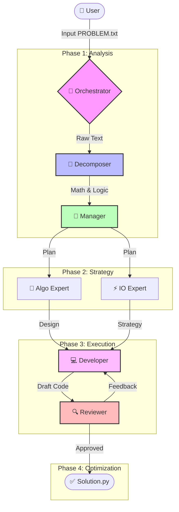

# 🧠 Multi-Agent DSA Solver


> **An autonomous coding assistant that solves Competitive Programming problems using a team of specialized AI agents.**

---

## 🏗️ System Architecture

This project uses a **multi-agent orchestration** pattern where different AI "personas" collaborate to solve complex algorithmic problems.



## 🚀 Key Features

| Agent | Role & Responsibility |
|-------|-----------------------|
| **🧩 Decomposer** | Breaks down high-level problems into core mathematical properties and sub-tasks. |
| **👔 Manager** | Coordinates the workflow, ensuring the strategy aligns with O(N) constraints. |
| **📐 Algo Expert** | Specializes in Identifying reductions (Graphs, DP, Combinatorics) and optimal logic. |
| **⚡ IO Expert** | Designs fast I/O optimizations (System.in, FastIO) crucial for large inputs (N=10⁶). |
| **💻 Developer** | Synthesizes mathematics and designs into executable Python code. |
| **🔍 Reviewer** | Acts as the Quality Assurance lead, checking for edge cases and complexity violations. |

## 📂 Project Structure

```text
├── 📄 orchestrator.py    # Main entry point; manages the agent lifecycle
├── 📄 agents.py          # Definitions of all Agent classes (Decomposer, etc.)
├── 📄 utils.py           # Helper functions (File I/O, OpenAI API calls)
├── 📄 solution.py        # The generated output code (Auto-created)
├── 📄 requirements.txt   # Project dependencies
├── 📄 .env               # API Keys configuration
└── 📁 data
    ├── 📄 PROBLEM.txt    # Paste your problem statement here
    └── 📄 input.txt      # Optional test case inputs
```

## 🛠️ Getting Started

### 1. Prerequisites
- Python 3.8 or higher
- An OpenAI API Key

### 2. Installation
Clone the repository and install dependencies:

```bash
git clone https://github.com/senpaisaul/multi-agent-dsa-solver.git
cd multi-agent-dsa-solver
pip install -r requirements.txt
```

### 3. Configuration
Create a `.env` file in the root directory:

```ini
OPENAI_API_KEY=sk-your-api-key-here
```

## ⚡ Usage Workflow

1.  **Paste your problem** into `PROBLEM.txt`.
2.  **Run the Orchestrator**:
    ```bash
    python orchestrator.py
    ```
3.  **Watch the Magic**: The agents will print their thought process to the console as they collaborate.
4.  **Get the Solution**: The final executable code will be saved to `solution.py`.

## 🤝 Contributing

Contributions are welcome! Please feel free to submit a Pull Request.

1. Fork the project
2. Create your Feature Branch (`git checkout -b feature/AmazingFeature`)
3. Commit your changes (`git commit -m 'Add some AmazingFeature'`)
4. Push to the Branch (`git push origin feature/AmazingFeature`)
5. Open a Pull Request

---

<p align="center">
  Made with ❤️ by the <a href="https://github.com/senpaisaul">SenpaiSaul</a> 
</p>
